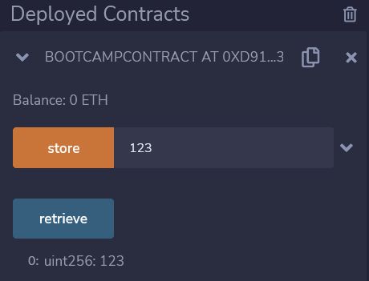

# Homework lesson 02

Date: 18.oct.2022

## Question 1: what does these transactions do?

Checked with the [ETH explorer](https://etherscan.io/):
- [0x0ec3f2488a93839524add10ea229e773f6bc891b4eb4794c3337d4495263790b](https://etherscan.io/tx/0x0ec3f2488a93839524add10ea229e773f6bc891b4eb4794c3337d4495263790b)

  at Jun-17-2016 03:34:48 AM +UTC

  TheDAO Attack: [medium doc](https://medium.com/@oaeee/the-rise-of-the-dark-dao-72b21a2212e3)
  and [Vitalik post](https://blog.ethereum.org/2016/06/17/critical-update-re-dao-vulnerability)

  9x TRANSFER 258.056564760381731336 Ether From TheDAO Token To TheDarkDAO

  by contract 0xc0ee9db1a9e07ca63e4ff0d5fb6f86bf68d47b89

  ERC20 Tokens transferred:

    9x contract to Null address for 25K ($334K) TheDAO

    1x contract to TheDAO token for 25K TheDAO

- [0x4fc1580e7f66c58b7c26881cce0aab9c3509afe6e507527f30566fbf8039bcd0](https://etherscan.io/tx/0x4fc1580e7f66c58b7c26881cce0aab9c3509afe6e507527f30566fbf8039bcd0)

  at Jun-05-2020 08:17:21 PM +UTC

  Created Contract 0x7a250d5630b4cf539739df2c5dacb4c659f2488d

- [0x552bc0322d78c5648c5efa21d2daa2d0f14901ad4b15531f1ab5bbe5674de34f](https://etherscan.io/tx/0x552bc0322d78c5648c5efa21d2daa2d0f14901ad4b15531f1ab5bbe5674de34f)

  at Aug-10-2021 04:05:47 PM +UTC

  From PolyNetwork Exploiter 1 (0xc8a65fadf0e0ddaf421f28feab69bf6e2e589963) 

  to itself (no value)

- [0x7a026bf79b36580bf7ef174711a3de823ff3c93c65304c3acc0323c77d62d0ed](https://etherscan.io/tx/0x7a026bf79b36580bf7ef174711a3de823ff3c93c65304c3acc0323c77d62d0ed)

  at Aug-12-2021 02:52:12 PM +UTC

  From PolyNetwork Exploiter 1 (0xc8a65fadf0e0ddaf421f28feab69bf6e2e589963)

  To 0x34d6b21d7b773225a102b382815e00ad876e23c2

  for 96M (thereafter in 10M transfers further transferred)

  => An Hack of 600M$ for 3$ gas fee

- [0x814e6a21c8eb34b62a05c1d0b14ee932873c62ef3c8575dc49bcf12004714eda](https://etherscan.io/tx/0x814e6a21c8eb34b62a05c1d0b14ee932873c62ef3c8575dc49bcf12004714eda)

  at Aug-19-2021 02:31:31 AM +UTC

  From 0x583e25de879e90cf5fc637f8dc16db8f10d91c17

  To PolyNetwork Exploiter 2 (0xa87fb85a93ca072cd4e5f0d4f178bc831df8a00b)

  for 160 Ether ($210K)

  => Bounty send to hacker..


## Question 2: largest account balance found:

0xc8a65fadf0e0ddaf421f28feab69bf6e2e589963 to 0x34d6b21d7b773225a102b382815e00ad876e23c2

Amount 96M

=> https://etherscan.io/accounts -> sort Top Accounts by Etherscan.


## Question 3: Special accounts:
- 0x1db3439a222c519ab44bb1144fc28167b4fa6ee6

  is an account with 1575 transactions

- 0x000000000000000000000000000000000000dEaD

  is a burn address


## Question 4: Remix exercise:
- [code](https://gist.github.com/extropyCoder/77487267da199320fb9c852cfde70fb1)

```
// SPDX-License-Identifier: None
pragma solidity 0.8.17;

contract BootcampContract {
  uint256 number;

  function store(uint256 num) public {
    number = num;
  }

  function retrieve() public view returns (uint256){
    return number;
  }
}
```

  - Compiled: Ok

  - Deployed:

    ```
    [vm] from: 0x5B3...eddC4 to: BootcampContract.(constructor) value: 0 wei data: 0x608...10033 logs: 0
    hash: 0xe5a...13243
    ```

    Address: 0xd9145CCE52D386f254917e481eB44e9943F39138

    Executed:

    
